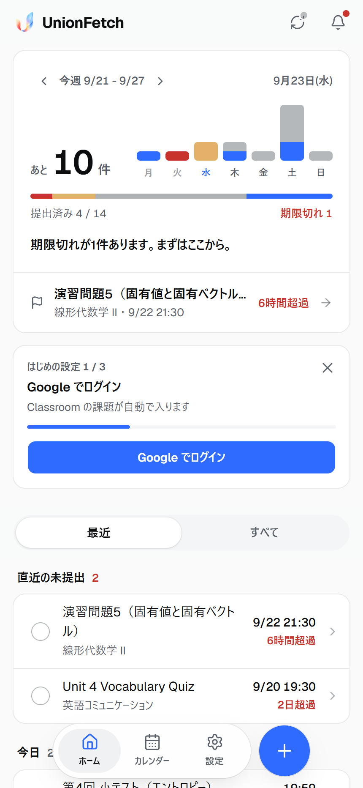
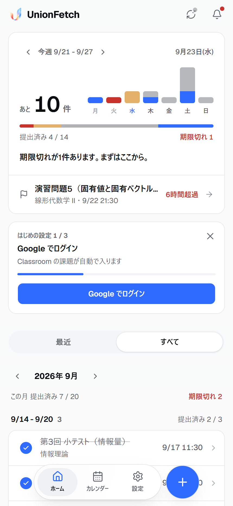
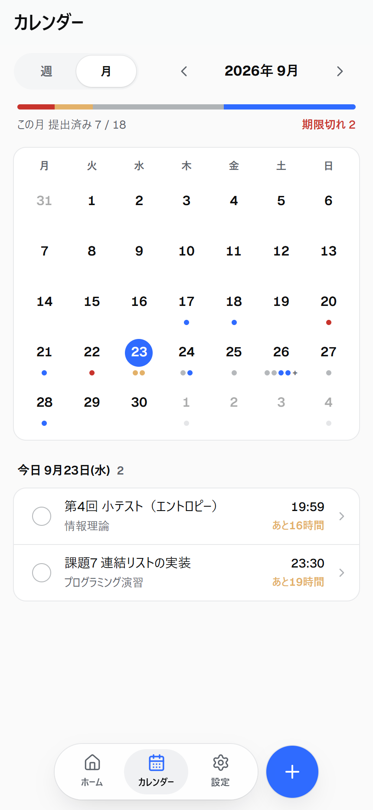
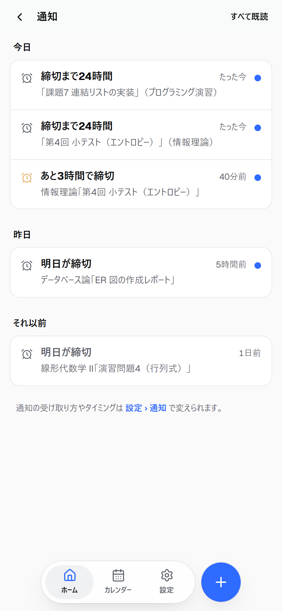
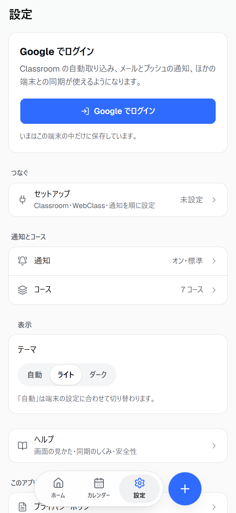
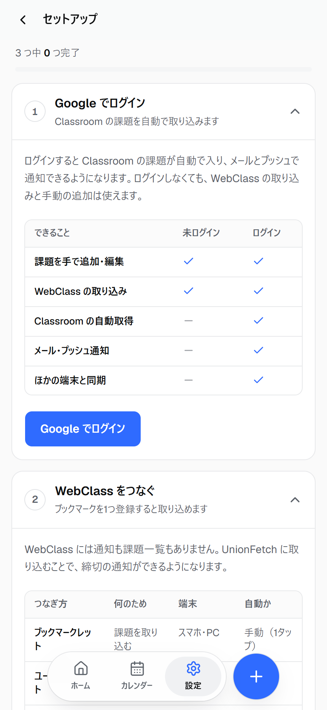
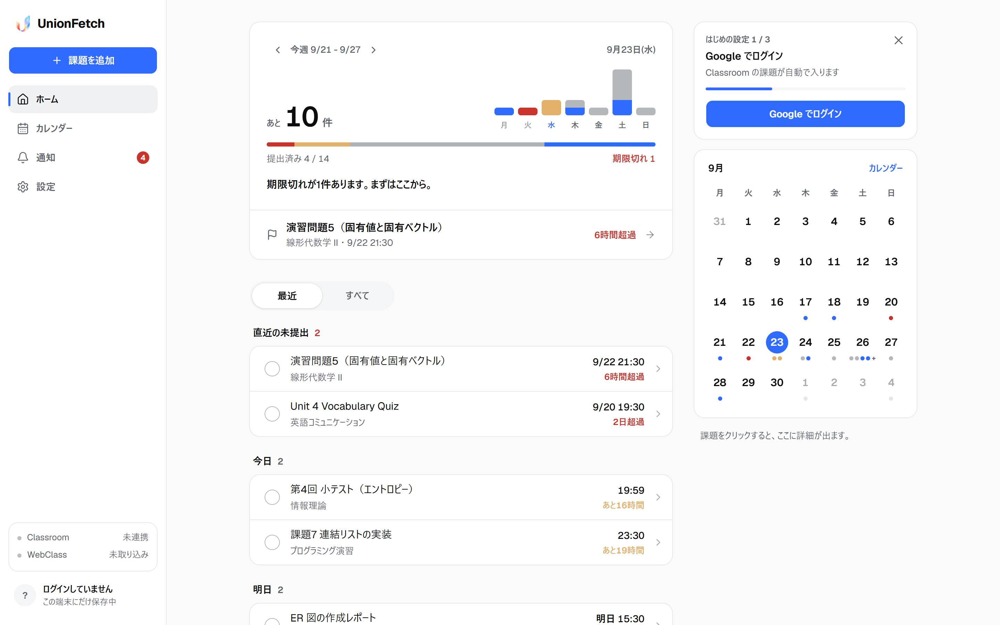
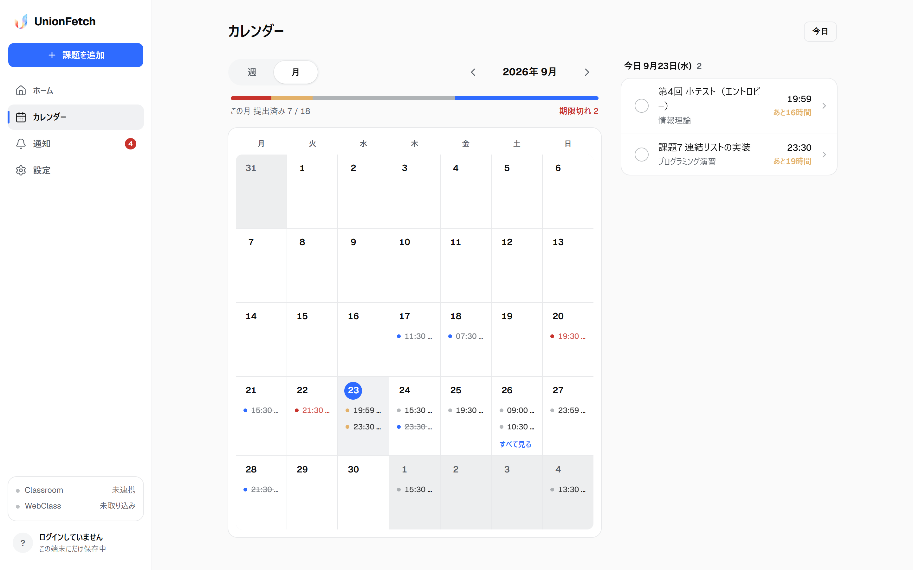
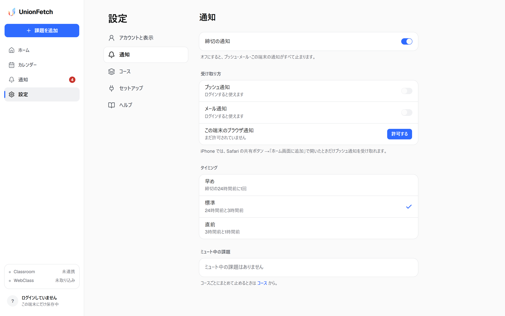

# UnionFetch

WebClass と Google Classroom の課題を1か所に集め、締切の前に通知する学生向け PWA。

URL : unionfetch.com

---

## 概要

大学の課題は複数の LMS に分かれて存在する。WebClass には通知機能がなく、自分で開かないと締切に気づけない。Google Classroom には通知があるが、WebClass の課題は含まれない。

UnionFetch は両方の課題を1つのリストに統合し、締切の前にメールと Web Push で通知する。あわせて、1週間の課題量と進捗をホーム画面で可視化する。

開発期間は 2026年6月18日 から 2026年9月23日。コミット 203件、マージ済み PR 85件。

---

## 画面

### モバイル

| ホーム | すべて（月ごと） | カレンダー |
|---|---|---|
|  |  |  |

| 通知 | 設定 | セットアップ |
|---|---|---|
|  |  |  |

### PC

ホーム。左にサイドバー、右に選んだ課題の詳細とミニカレンダー。



カレンダー。



設定。左に項目一覧を固定する2ペイン構成。



画像はデモ用のダミーデータで撮影している。撮り直しは `node scripts/shots.mjs`。

---

## 開発背景

- WebClass は多くの大学で採用されている LMS だが、締切の通知機能がない
- 周囲から「気づかず出し忘れた」という声を複数回聞いた。開発者自身も同じ失敗をした
- Classroom には通知があるため、学生は通知が来る課題と来ない課題を別の場所で管理している状態になる
- どちらのサービスも1週間単位の総量を表示しない。課題は個別のリストとして並ぶだけで、残量と進捗が数字にならない
- 大学生の生活は1週間単位で回る。可視化の単位を1週間に合わせる必要があると判断した

通知の欠落と全体像の欠落を同時に解くことを目的とした。

---

## 主な機能

| 機能 | 内容 |
|---|---|
| 課題の集約 | WebClass と Google Classroom の課題を1つのリストに統合 |
| 今週の可視化 | 曜日ごとの課題数を積み上げ棒グラフで表示。状態別に色分けした進捗バーで週の構成を表示 |
| 締切通知 | メールと Web Push。24時間前 / 3時間前 / 1時間前から選択。WebClass の課題にも通知する |
| カレンダー | 月表示と週表示。日を選ぶとその日の課題を表示 |
| 手動追加 | LMS に無い課題を自分で登録 |
| コース管理 | コース単位で表示/非表示と通知のオン・オフを設定 |
| 未ログイン利用 | IndexedDB に保存。ログイン後にサーバへ同期 |
| PWA | ホーム画面に追加してアプリとして起動。オフライン時は直前の内容を表示 |

---

## 主要ユースケース

1. 朝アプリを開き、今週の残り件数と曜日ごとの負荷を確認する
2. WebClass を開いたついでにブックマークレットで課題を取り込む。PC では Tampermonkey で自動取得
3. 締切の前にメールまたはプッシュ通知を受け取る
4. 提出後、リストの丸チェックを押して提出済みにする
5. 来週以降の課題を、すべてタブで月単位に切り替えて確認する

---

## プロダクト方針

| 方針 | 理由 |
|---|---|
| WebClass の通知を最優先する | 本来存在しない機能であり、代替手段がない |
| 可視化の単位を1週間にする | 学生の生活サイクルに合わせる |
| モバイルを設計の起点にする | 学生の利用はスマートフォンが中心。PC レイアウトも用意する |
| 提出済みも表示する | 未提出のみを並べると進捗が視覚化されない |
| 読み取り専用に限定する | 課題の提出や成績の取得は行わない。取得するのは課題名・締切・提出したかどうかのみ |

---

## 技術スタック

| 領域 | 技術 |
|---|---|
| フレームワーク | Next.js 16（App Router） / React 19 / TypeScript |
| スタイル | Tailwind CSS v4（`@theme inline` によるトークン駆動） / shadcn 由来の部品 |
| アニメーション | Motion（`prefers-reduced-motion` 対応） |
| 認証 | NextAuth v5（Google OAuth） |
| DB | Supabase（PostgreSQL・東京リージョン） / Prisma |
| クライアント保存 | IndexedDB（`idb`） |
| 通知 | Resend（メール・予約配信） / Web Push（VAPID） |
| レートリミット | Upstash Redis |
| ホスティング | Vercel（Cron による通知バッチ） |
| PWA | Service Worker |

---

## アーキテクチャ

詳細は [docs/architecture.md](docs/architecture.md)。

### ログイン中は DB が真実のソース

IndexedDB は表示用のミラーとして扱う。未ログイン時のみ一次ストアとして機能する。ログインせずに試せる状態を保ちつつ、二重管理を避けるための分離。

### 読み取りは3段構え

```
段1  IndexedDB のキャッシュを即描画
段2  GET /api/assignments（DB から読む。Google を叩かない）
段3  POST /api/classroom/sync（Google と同期。裏で実行・5分スロットル）
```

各段は独立した try/catch で実行する。後段が失敗しても前段の表示は残るため、Google API の遅延や失効で画面が壊れない。

この分離は後からのリファクタで導入した。当初は取得と同期が同じ経路にあり、Google 側の失敗がそのまま画面の失敗になっていた。

### 書き込みは楽観更新と部分書き込み

提出状況の変更は先に画面へ反映し、失敗時にロールバックする。全件置換ではなく1件単位の upsert とすることで、同期中の操作が巻き戻らない。

---

## ページ構成

```
/                ホーム      今週のカード（棒グラフ・進捗バー）＋ 最近 / すべて のリスト
/calendar        カレンダー  月表示・週表示、選択日の課題
/activity        通知        送信履歴と既読管理
/settings        設定        アカウント・テーマ
  /notifications             通知のオン・オフ、チャネル、タイミング、ミュート
  /courses                   コースの表示/非表示と通知
  /setup                     WebClass 連携の手順
  /help/{screen,sync,safety} ヘルプ3画面
/import          取り込み    ブックマークレットからの着地点
/login           ログイン
```

モバイルは下タブ3つと中央の追加ボタン。PC は左サイドバーと右カラム（選択した課題の詳細）。

データフローのシーケンス図は [docs/data-flow-scenarios.md](docs/data-flow-scenarios.md)。

---

## DB 設計

```
User ─┬─ Account / Session          NextAuth
      ├─ Assignment                 課題本体
      ├─ NotificationSetting        通知設定（1:1）
      ├─ PushSubscription           Web Push の購読
      └─ importTokenHash            自動同期用トークンのハッシュ
```

Assignment の設計上の要点。

- `sourceKey` に外部の安定 ID を持つ（`webclass:<contents_id>` / `classroom:<courseWorkId>`）。課題名や締切が変わっても同一の課題として追えるため、通知の重複防止キーが安定する
- `deletedAt` による論理削除。同期で復活させないため
- `editedFields` にユーザーが手で直した項目を記録する。同期時にその項目だけ上書きしない
- `submissionState` は `not_submitted` / `submitted` / `unknown` の3値。現在の取得経路では `unknown` は発生しない
- ユーザー削除時は Cascade で全リレーションを削除する（`DELETE /api/account`）

---

## WebClass 連携

詳細は [docs/webclass-api.md](docs/webclass-api.md)。

### 内部 JSON API を使う

公式 API がないため、当初は課題実施状況一覧の DOM を解析していた。表示の文字列に依存するため壊れやすく、提出状況の判定も曖昧だった。

調査の結果、画面が内部で呼んでいる JSON API を同一オリジンの GET で利用できることが分かり、全面的に切り替えた。

```
GET {BASE}/ip_mods.php/plugin/score_summary_table/courses
GET {BASE}/ip_mods.php/plugin/score_summary_table/contents?group_id=<id>
```

実行は学生自身のブラウザの、学生自身のログイン済みセッションで行う。認証情報はサーバに送らない。

### 大学のサーバへの負荷対策

| 対策 | 効果 |
|---|---|
| `fetch` のキャッシュを無効化しない | ブラウザが `If-Modified-Since` を自動付与し、変化がないコースは 304 で返る |
| コースごとに直列 + 250ms 間隔 | 合計が同じでも瞬間負荷を下げる |
| 年度が2年以上前のコースは取得しない | 実測で22コースから13コースに削減 |
| 自動同期は60分に1回 | タブを何枚開いても1回 |

定常状態では1時間に1回・十数コース・ほとんどが 304 になる。

### 取得項目の最小化

`scores` には学籍番号・氏名・点数が含まれるが、読まずに捨てる。使用するのは `answer_datetime`（提出時刻の有無）のみ。プライバシーポリシーの記載を実装で保証するための制約。

### 2つの実行経路

| | ブックマークレット | ユーザースクリプト |
|---|---|---|
| 実行 | 手動 | WebClass を開くと自動 |
| 対応環境 | PC / Android / iOS Safari | Tampermonkey |
| 送信 | `/import#<JSON>` を開く | API へ直接 POST |
| 認証 | セッション Cookie | 取り込みトークン |

取得ロジックは1か所に集約し、そこから両方を生成する。iOS では拡張機能が使えないため、ブックマークレットは恒久的に維持する。

---

## 通知

メールと Web Push の2チャネル。実装上の差は予約送信の可否にある。

| | メール（Resend） | Web Push |
|---|---|---|
| 予約送信 | できる | できない |
| 送信タイミング | 事前に登録 | 送りたい時刻に誰かが実行する必要がある |
| iOS | 届く | ホーム画面に追加した PWA のみ（16.4+） |

Web Push は予約送信の仕組みがないため、Vercel Cron 前提の設計になる。Hobby プランの Cron は1日1回しか実行されず、3時間前通知が成立しない。このためメールを主、プッシュを従とした。

送信対象の算出は `src/lib/server/notification-logic.ts` にあり、予約と取りこぼしの追いつきの両方を扱う。cron は DB を参照するため、Classroom・WebClass・手動追加のすべてが通知対象になる。

経緯は [docs/notification-history.md](docs/notification-history.md)、今後の仕様案は [docs/notification-design.md](docs/notification-design.md)。

---

## 設計上の判断とトレードオフ

### 認証をクライアント完結からサーバサイドへ移した

初期実装は Google Identity Services の Implicit Flow で、クライアントのみで完結していた。しかしアクセストークンの有効期限が1時間で、サイレントリフレッシュはポップアップに依存するため Safari で動作しなかった。localStorage にリフレッシュトークンを保存する案はセキュリティ上却下した。

結果として NextAuth v5 によるサーバサイド認証へ移行した。判断の経緯は [docs/auth-decision-log.md](docs/auth-decision-log.md)。

トレードオフ: サーバとデータベースが必須になり、構成が重くなった。一方でトークンをクライアントに置かずに済み、複数端末での同期も可能になった。

### 提出状況を3値から2値に減らした

当初は提出済み / 未提出 / 不明 の3値で、UI にも不明専用の表示を用意していた。

実測の結果、不明は実装の都合で生まれた状態だった。旧実装は課題一覧の状態列を読んでいたが、この列は教員が採点ラベルを設定したときだけ埋まり、112行中84行が空だった。空欄を不明に倒していたことが原因である。

API の `answer_datetime` は必ず値か null のどちらかで、112行すべてで画面表示と一致した。不明は存在しないため、UI から概念を削除した。

トレードオフ: 型としての `unknown` は残している。API 方式より前に取り込んだ行が DB にあるため。これらは画面では未提出として表示され、チェックを押せば解消される。データ移行を避けるための判断。

### クロスサイト送信のための専用トークン

ユーザースクリプトは WebClass のページから UnionFetch へ送信するためクロスサイトになる。NextAuth のセッション Cookie は `SameSite=Lax` のため付与されない。

取り込み専用のトークンを発行して対応した。

- 平文は発行時の応答に一度だけ現れ、DB には SHA-256 のハッシュのみ保存する
- トークン経由の応答は課題一覧を返さない（件数のみ）。返すとトークンが書き込みだけでなく読み取りの能力を持つため

トレードオフ: ユーザーが1回トークンを貼る手間が発生する。自動同期を諦めれば不要だが、WebClass を開くだけで同期される体験を優先した。

### 色の定義を1ファイルに集約した

モック段階で色の定義をリスト・カレンダー・グラフの3か所に分散させた結果、提出済みがリストでは青、カレンダーでは灰、ヘルプの説明では緑と3通りに分かれた。

本番移行時に `src/lib/status.ts` へ一本化し、リスト・カレンダー・グラフ・ヘルプの凡例がすべて同じ定数を参照する構造にした。ヘルプの色見本もハードコードせず実装から描画する。

### UI を繰り返し作り直した

7月に本番 UI を複数回刷新し、9月にモックを5世代作ってから本番へ移行した。

初期は Vercel 風のミニマルな方向で作ったが、アプリ画面には合わなかった。ランディングページは読ませる画面で余白が主役だが、アプリは操作させる画面であり、行が押せることが分かり指が入る必要がある。

その後も全体が1サイズ大きい、罫線が多く視認性が落ちる、といった問題で振れた。最終的に実在の SaaS の computed style を実測して基準値を作り、モックを5世代並べて比較した上で確定させた。

経緯は [docs/ui-playbook.md](docs/ui-playbook.md)、移行の記録は [docs/ui-v5-migration.md](docs/ui-v5-migration.md)。

---

## 開発の経緯

| 時期 | 内容 |
|---|---|
| 6月中旬 | Google Classroom 連携 MVP、WebClass 連携、Vercel デプロイ |
| 6月下旬 | PWA 化、ローカル通知、手動課題追加、通知センター。IndexedDB の初期化不整合を修正しスキーマを v3 へ |
| 6月下旬 | 認証を NextAuth へ移行。Supabase と Prisma で DB 基盤を構築し、メール通知を実装 |
| 6月末 | サーバサイド課題保存とスマート同期。コース管理、課題の編集と論理削除、通知設定の DB 同期 |
| 6月末 | 読み取りと同期の分離。`useAssignments` を SWR 3段構成へ |
| 7月上旬 | 再同期の性能問題を解消（差分検出と並列化）。プライバシーポリシーと利用規約を追加 |
| 7月上旬 | 入力バリデーション、レートリミット、アカウントの自己削除、データ最小化 |
| 7月中旬〜下旬 | UI を複数回刷新。カレンダーをホームへ統合、課題詳細カード、ボトムナビ |
| 9月上旬 | WebClass を DOM 解析から内部 JSON API へ全面移行。Tampermonkey による自動同期、Web Push を追加 |
| 9月上旬 | アプリ名を UnionFetch に変更、独自ドメインへ移行 |
| 9月中旬〜下旬 | UI をモック5世代で設計し直し、11本の PR に分割して本番へ移行 |

### 印象に残った不具合

| 症状 | 原因 |
|---|---|
| 再同期のたびに全件 UPDATE が走る | `courseColor` の採番が非決定的で毎回差分として検出されていた。`isLate` が `undefined` になる経路もあり、同じ行が無限に更新され続けていた |
| 同期時に Prisma がコネクションプールを枯渇させる（P2024） | 直列 UPDATE を解消するために並列化した際、同時実行数を制限していなかった |
| Classroom の締切が59分ずれる | Classroom API の `dueTime` の扱いを誤っていた |
| Safari でのみ課題取得と取り込みが失敗する | IndexedDB のトランザクション内で `await` すると自動コミットされ、後続の `put` が `TransactionInactiveError` になる |
| 日付をまたぐと今日の位置がずれる | サーバのタイムゾーンで算出した日付が静的化で焼き付いていた |
| 課題の3分の2が取り込まれていない | `end_date` がない課題を除外していた。実測では Question の66%に締切がなく、未提出21件が表示されていなかった |

---

## 開発の進め方 — Agentic Coding

実装はすべて AI（Claude Code）が書いている。開発者が担当したのはコードを書くこと以外の領域である。

### 担当した役割

#### 1. ペルソナと課題感の設定

誰がどの瞬間に何に困っているかを決める作業。1週間単位で生活する大学生、課題の総量が把握できない状態、といった言語化がプロダクト方針になり、AI の出力を評価する基準になった。基準がなければ、出力は要求を満たしているように見えて方向が違うものになる。

#### 2. プロダクト品質の判断

AI は指示された機能を満たすものを短時間で出力する。一方で、素っ気ない・窮屈・視認性が低いといった質の判断は人間が行わないと収束しない。

指摘を「ダサい」で止めず、ボタンが小さい、1行に色が2か所あって優先順位が読めない、といった具体まで落とすことを繰り返した。UI を複数回作り直せたのは、毎回何が悪いかを言語化し直したためである。

#### 3. AI が作業しやすい導線の整備

最も効果が大きかった領域。

- docs を先に整備する。アーキテクチャ、データフロー、WebClass の API 仕様、UI の作法を文書化し、AI が毎回参照する状態にした。文脈がファイルにあればセッションをまたいでも判断がぶれない
- 決定事項を表で固定する。論点と結論を一覧にして、後から蒸し返さないようにした
- 計画を立ててから実装させる。大きな変更は計画を出させ、合意してから着手する。UI の本番移行は PR を11本に分割し、1本ずつ検証しながら進めた
- AI 自身にスキルを書かせる。このリポジトリ固有の作法（色の決め方、要素が溢れたときの挙動、禁止事項）を `.claude/skills/unionfetch-ui` にまとめ、以降の作業で自動的に参照されるようにした

#### 4. MCP とスキルの活用

- Motion MCP。アニメーション実装時に公式ドキュメントを参照させる
- ブラウザ操作。DOM とネットワークの読み取り（後述）
- デザイン系スキル。配色と余白の作法を参照し、アプリ画面に合わない部分は採用しない

#### 5. 出力を検証する

AI の報告をそのまま採用しない運用にした。この過程で見つかった問題の例。

- 不明は発生しないという報告に対し、表記が統一されていない点を指摘して差し戻したところ、最初の集計が誤っていた。コースごとに分かれた7つの表を1つの表として読んでいた。取り直して112行を1行ずつ突き合わせ、結論が確定した
- ドキュメントに反映したという報告に対しコードを確認したところ、実装が漏れていた
- 修正したという報告に対し実機で確認したところ、修正の過程で回帰が入っていた（保存済みトークンを毎回聞き直す）

#### 6. AI の傾向を先読みする

AI は指示を満たす最短経路を取る傾向がある。放置するとモックのままのボタンが本番に残る、グラフの目盛りがデータ依存になり週をまたいだ比較ができなくなる、といった形で表面化する。完了報告の裏にある省略を予測して先に確認することがレビューの主な作業だった。

#### 7. コンテキストの管理

長いセッションでは過去の決定を忘れる、古い前提で動くといった問題が出る。対策として次を運用した。

- 決定事項を docs に書かせ、次のセッションで読ませる
- `CLAUDE.md` に制約を常駐させる（DB 変更は `db push`、PR はユーザーがマージ、メールアドレスを書かない等）
- 会話が長くなったら要点を文書化してから継続する

このリポジトリの docs が17ファイル・3,479行あるのはその結果である。

### ブラウザ操作による仕様確定

AI にブラウザを操作させ、実際の DOM とネットワークを読ませて仕様を確定させた。

- WebClass の内部 API を、ログイン済みのブラウザから直接呼んでレスポンスの形を確定
- 課題一覧の画面（112行）と API のレスポンスを1行ずつ突き合わせ、状態列が提出状況を表していないことを確認
- ユーザースクリプトが動作していない原因を、ネットワークリクエストが発生していない事実から特定
- 取り込みの所要時間を実測し、前面タブ約5秒・背面タブ約13秒（Chrome のタイマー間引きによる）と定量化

スクリーンショットは検証手段として使わない運用にした。ブラウザのペインが背面にあると `requestAnimationFrame` が停止し、入場アニメーションが `opacity: 0` のまま固定されて空白に写るためである。`getComputedStyle` と要素数の計測に統一した。

---

## ローカル開発

```bash
npm install
cp .env.example .env.local
npx prisma generate
npm run dev
```

### 環境変数

| 変数 | 用途 |
|---|---|
| `DATABASE_URL` | Supabase のプーラー（pgbouncer / 6543）を指定する。直結はサーバーレスで接続が枯渇する |
| `DIRECT_URL` | Prisma のスキーマ適用用（直結） |
| `AUTH_SECRET` | NextAuth |
| `AUTH_GOOGLE_ID` / `AUTH_GOOGLE_SECRET` | Google OAuth |
| `RESEND_API_KEY` | メール送信 |
| `VAPID_PUBLIC_KEY` / `VAPID_PRIVATE_KEY` | Web Push |
| `CRON_SECRET` | 通知バッチの保護 |
| `UPSTASH_REDIS_REST_URL` / `UPSTASH_REDIS_REST_TOKEN` | レートリミット |

### 注意点

- スキーマ変更は `npx prisma db push` を使う。`migrate dev` は履歴のドリフトにより本番 DB のリセットを要求する
- Windows で `prisma generate` が EPERM になる場合は dev サーバを停止してから実行する
- ビルドは `prisma generate && next build`。マイグレーションは実行しない

---

## 今後

- 通知仕様の見直し。現在のプリセット3種から [docs/notification-design.md](docs/notification-design.md) の構成へ
- 他大学への展開。ベース URL は自動解決するため、同じプラグインが導入されていれば動作する想定
- 未実装項目は [docs/backlog.md](docs/backlog.md) に整理

---

## ドキュメント

| ファイル | 内容 |
|---|---|
| [architecture.md](docs/architecture.md) | データフローと構成 |
| [data-flow-scenarios.md](docs/data-flow-scenarios.md) | 場面別のシーケンス図 |
| [webclass-api.md](docs/webclass-api.md) | WebClass 内部 API の仕様、負荷対策、実測結果 |
| [auth-decision-log.md](docs/auth-decision-log.md) | 認証方式の比較検討と選定理由 |
| [notification-history.md](docs/notification-history.md) | 通知機能の開発経緯とプラットフォーム差異 |
| [product-brief.md](docs/product-brief.md) | プロダクトの価値定義 |
| [ui-playbook.md](docs/ui-playbook.md) | UI の作法、アンチパターン、確定値 |
| [ui-v5-migration.md](docs/ui-v5-migration.md) | UI 全面移行の記録 |
| [backlog.md](docs/backlog.md) | 未実装機能とセキュリティ・法務の課題 |

---

## ライセンス

未定。

---

UnionFetch は Google・WebClass とは関係のない非公式ツールです。課題は読み取り専用で取得し、パスワードは扱いません。
