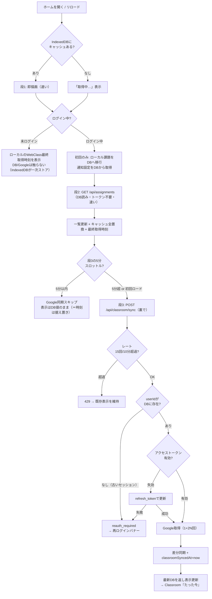
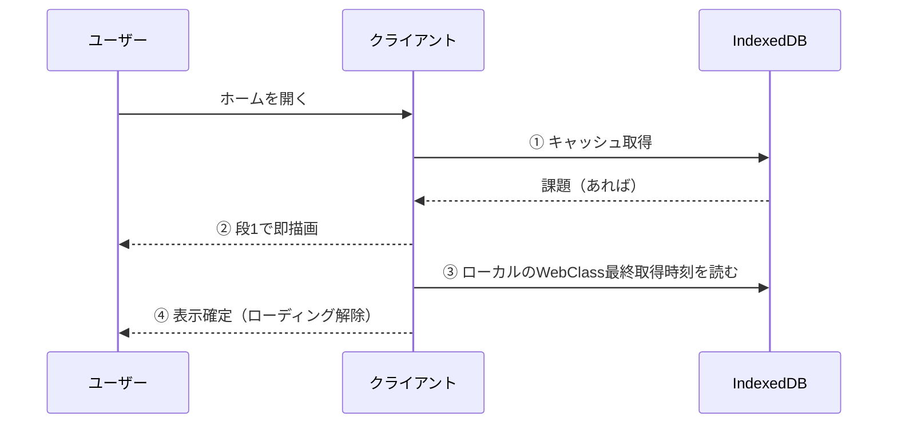
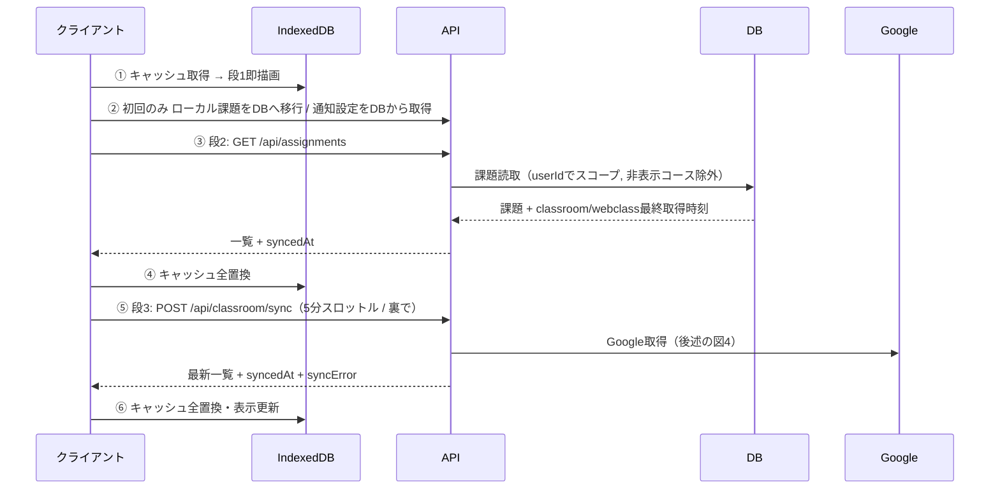
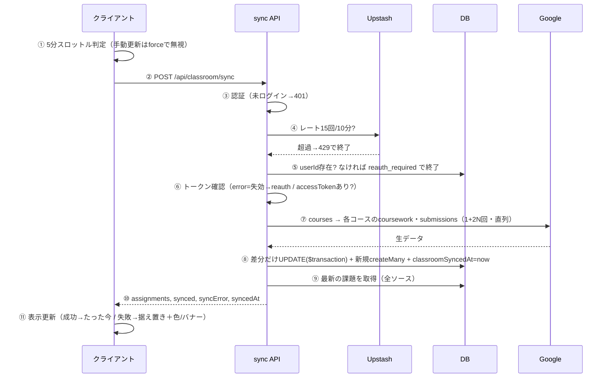
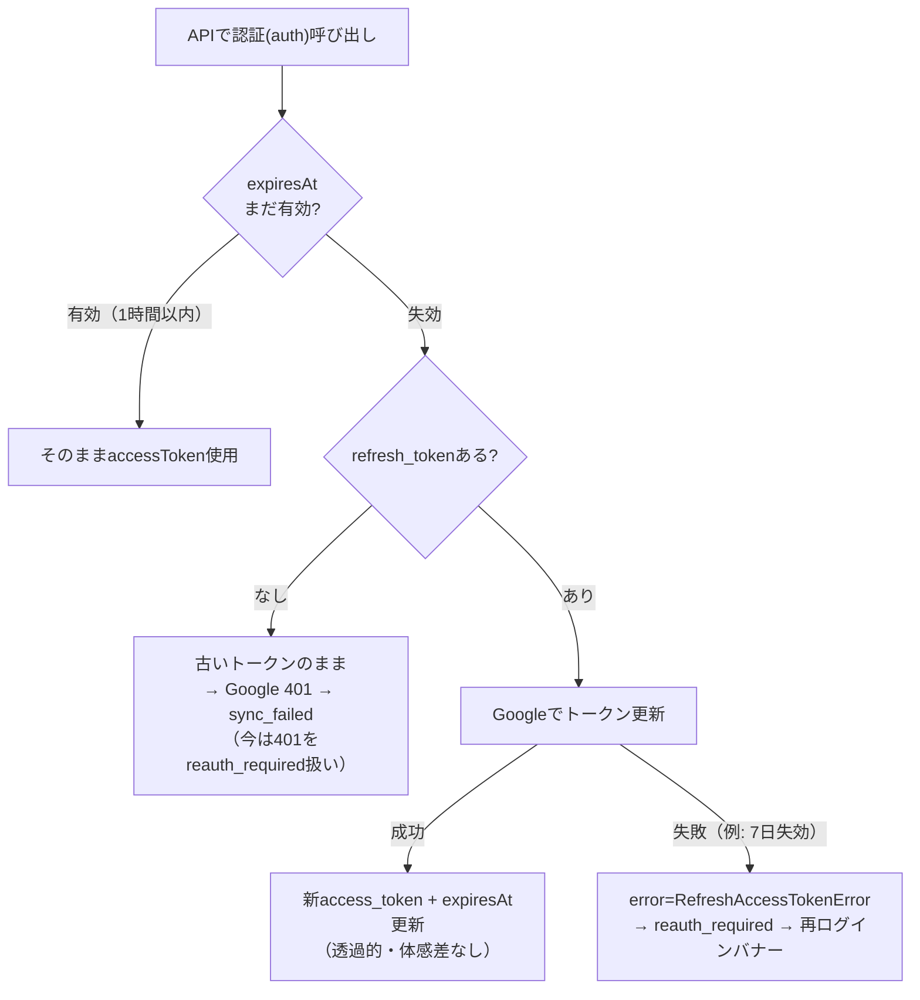
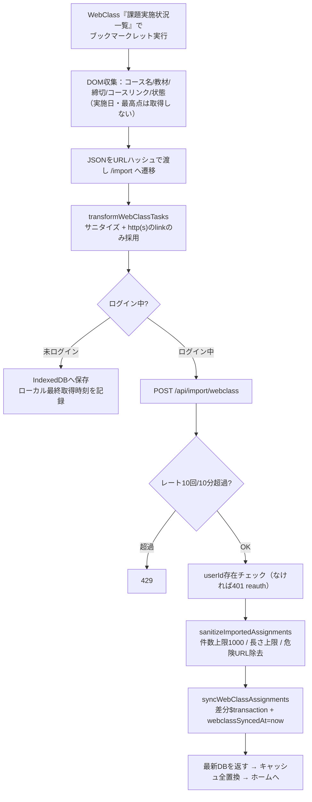
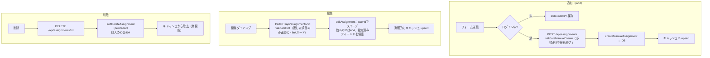
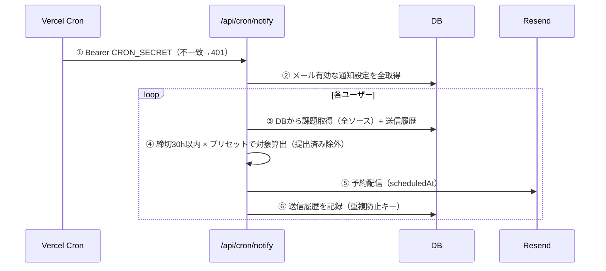
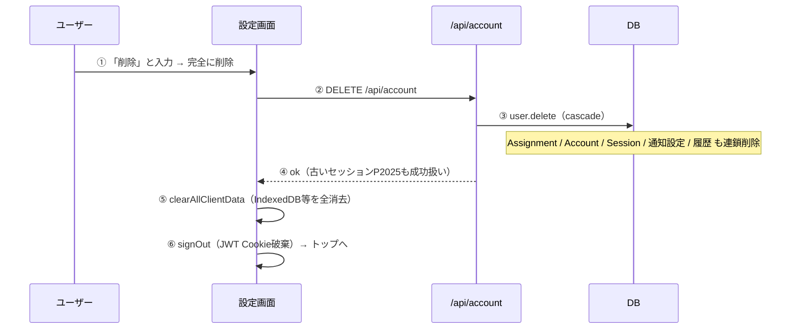

# Class Pilot — 場面別データフロー図鑑

構成の正本は `docs/architecture.md`。本書はその「図解・場面別」版で、ログイン状態・ソース
（WebClass / Classroom）・各種タイミング（5分・1時間・レート）まで含めて正確に追える。
図は Mermaid（GitHub 上で図として表示される）。関数名は理解の助けに一部併記。

## 用語・登場人物
- **クライアント**: ブラウザ側（`useAssignments` 等）
- **IndexedDB**: 端末内キャッシュ（未ログイン時は一次ストア、ログイン時は表示用ミラー）
- **API**: Next.js のルートハンドラ（サーバー）
- **DB**: Supabase(PostgreSQL)。**ログイン中はここが真実のソース**
- **Google**: Google Classroom API
- **Upstash**: レートリミット用 Redis

## タイマー・上限の早見表
| 名前 | 値 | 何を意味するか | 挙動 |
|------|----|----------------|------|
| Google同期スロットル | **5分** | クライアントが Google 同期(段3)を再実行する最短間隔（`lastSyncTime`） | 5分以内はスキップ。**ハードリロード/新規タブでリセット**、SPA遷移では保持。手動更新(force)は無視 |
| アクセストークン有効期限 | **約1時間** | Google のアクセストークン | 失効時、次の同期で `refresh_token` により自動更新 |
| レートリミット sync | **15回/10分** | ユーザー単位（Upstash） | 超過で `429`。env未設定はフェイルオープン(許可) |
| レートリミット import | **10回/10分** | ユーザー単位 | 同上 |
| refresh_token 失効 | **7日**（OAuth Testing時） | 本番未公開だと失効 | 失効→`reauth_required`。本番公開(A2)で解消 |
| メール通知 cron | **毎日** | 締切 **30時間以内** の未提出を通知 | DBベース・全ソース対応 |

---

## 図0. 全体フローチャート（ホームを開いた／リロードした時）

**要点**：ユーザーが待つのは段1（即）と段2（DB読み）だけ。重い Google 取得（段3）は裏で・5分スロットル付き。
「Classroom 最終更新が『たった今』にならない」時は、`M/O/Q/R` のどこかで止まっている（レート/古いセッション/トークン）。

---

## 図1. 未ログインでホーム表示

1. IndexedDB から課題を取得。
2. あれば即描画（段1）。
3. WebClass の最終取得時刻（localStorage）を読む。
4. 表示確定。**DB も Google も一切呼ばない**。この状態では IndexedDB が唯一の保存先。

---

## 図2. ログイン済みでホーム表示（SWR 3段フェッチ）

1. キャッシュを即描画（段1）。
2. 初回ログイン時だけ、ローカル専用課題(`wc-`/`manual-`)を DB へ引き上げ、通知設定を DB から取り込む。
3. 段2で DB を読む（**トークン不要・速い・堅牢**）。ここで表示がほぼ確定。
4. キャッシュを DB 内容で全置換。
5. 段3で Google 同期（5分スロットル、裏で非同期）。
6. 成功すれば最新で再描画。失敗しても段2の表示は維持。

---

## 図3. Classroom 同期の内部（POST /api/classroom/sync）＝図0の右下を詳細化

- ⑧ の差分検出：既存値と違うフィールドだけ UPDATE（変更無し＝0件で一瞬）。`$transaction` で1接続に多重化し接続プール枯渇(P2024)を回避。`courseColor` は courseId から決定的、`isLate` は boolean 正規化済み（＝毎回全件UPDATEにならない）。
- **失敗の分類**：`401/403`(トークン無効) と `P2003`(userId不在) → **reauth_required**（再ログインで回復）。それ以外の例外 → **sync_failed**（赤表示・時刻据え置き）。握りつぶさず必ず `syncError` で返す。

---

## 図4. トークン更新（アクセストークンの1時間失効）

1. 毎リクエストの `auth()` でトークンの有効期限を確認。
2. 1時間以内なら現行トークンを使用。
3. 失効していれば `refresh_token` で更新を試みる。成功なら透過的に継続、失敗なら再ログインを促す。
4. **1時間は「同期の5分間隔」とは別物**。5分＝どれくらいの頻度で Google を叩くか、1時間＝トークンをいつ更新するか。

---

## 図5. WebClass 取り込み（ブックマークレット）

1. ブックマークレットが一覧ページの DOM を収集（**成績＝最高点、実施日は収集しない**＝データ最小化）。
2. `/import` へ URL ハッシュで受け渡し、クライアントで正規化。
3. 未ログインは IndexedDB のみ。ログイン中はサーバーへ POST。
4. サーバーは **レート → userId存在 → サニタイズ（非信頼入力の再検証）→ 差分同期**。危険な `javascript:` 等の link は空にされる。

---

## 図6. 手動 追加 / 編集 / 削除

- 追加/編集は**サーバー側で必ず検証**（必須欠落・不正日付・不正状態→400、超長文字列→切り詰め、link→http(s)のみ）。
- 編集・削除は `userId` スコープなので**他人の課題は取得も改ざんも削除も不可（404）**。
- UI は楽観的更新（サーバー確定を待たず即反映、失敗時に戻す）。

---

## 図7. メール通知 cron（毎日・DBベース・全ソース）

1. Cron が秘密トークンで起動。
2〜4. **DB を読むだけ**（Google 再取得なし＝トークン非依存・堅牢）。WebClass・手動課題も対象。
5. Resend の予約配信で締切前の適切な時刻に送る。
6. 送信済みは履歴に記録し二重送信を防ぐ。

---

## 図8. アカウント削除

1. 破壊的操作のため「削除」入力を要求。
2〜3. User 1行の削除で関連データが cascade で全消去。
5〜6. 端末内ミラーとログイン Cookie も消し、完全にサインアウト。

---

## 真実のソースの整理
| 状態 | 真実のソース | IndexedDB の役割 | Google |
|------|--------------|------------------|--------|
| ログイン中 | **DB** | 表示用ミラー（段2で全置換） | 段3で裏同期（5分スロットル） |
| 未ログイン | **IndexedDB** | 一次ストア（唯一の保存先） | 触らない |

## 「同期しても『たった今』にならない」の切り分け（図0/3対応）
1. 赤「**同期に失敗**」表示 → サーバーが `sync_failed`（例外）。Vercel ログの `[SYNC]` を確認。
2. 橙「**要再ログイン**」＋バナー → `reauth_required`（古いセッション or トークン失効）。**本番ドメインで再ログイン**。
3. 何も出ず時刻据え置き → 5分スロットルでそもそも段3が走っていない、またはレート429。
